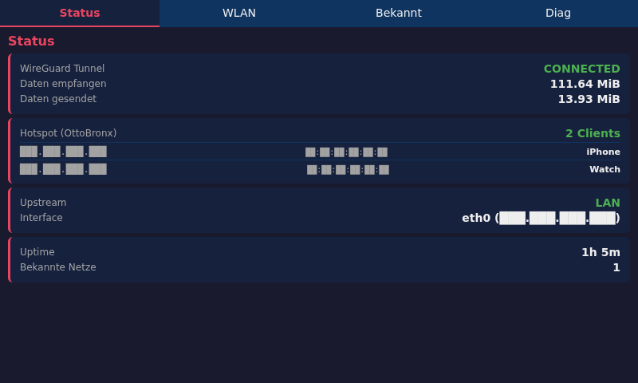
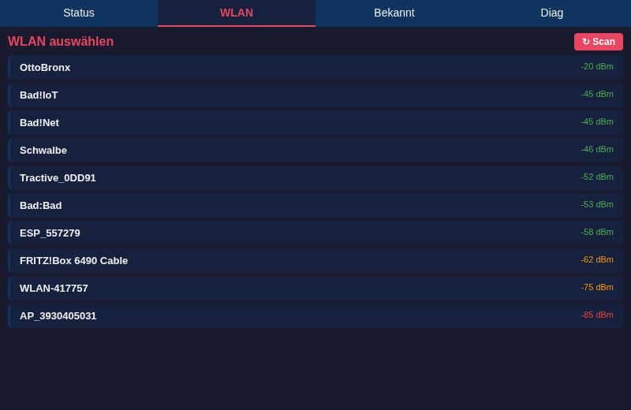
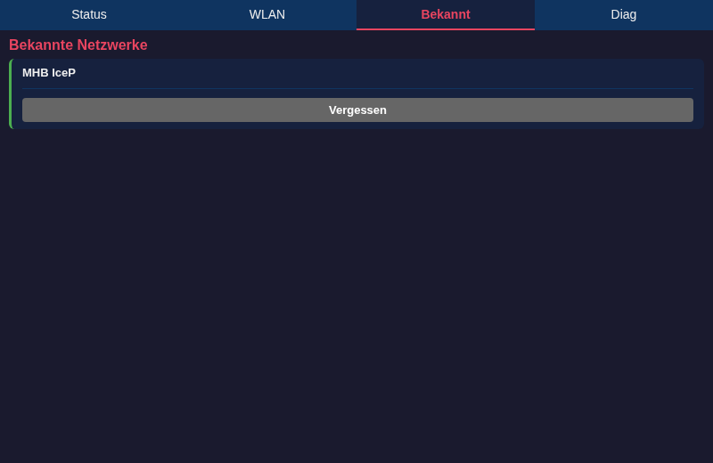
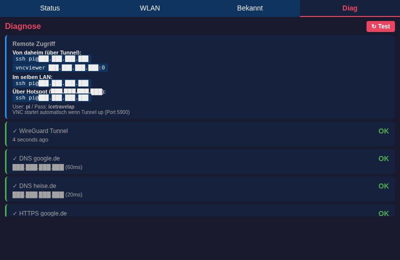

# IceTravelAP v1.1

Verwandelt einen Raspberry Pi 4 in einen Reise-Router, der sich mit bekannten WLANs (oder LAN) verbindet und allen Traffic über einen WireGuard-Tunnel zum Heimnetz leitet — sicher, mit Heim-IP, Geoblocking-frei, und mit einem 7" Touch-Display als Bedienpanel.



## Features

- **LAN-first / WLAN-Fallback / Setup-AP** — eth0 hat Vorrang (30s Timeout), dann bekannte WLANs auf wlan1, sonst Setup-Hotspot mit Webportal
- **WireGuard-Tunnel** mit DDNS-Auflösung über öffentliche DNS-Server (funktioniert auch wenn der Heim-DNS nicht erreichbar ist)
- **MTU/MSS-Clamping** automatisch — alle gängigen Webseiten und VoIP/SIP funktionieren
- **Touch-Portal** auf 800×480 (DSI 7"-Display) mit Tabs für Status / WLAN / Bekannte / Diagnose
- **Virtuelle Tastatur** für Passwort-Eingabe direkt im Browser
- **Pushover-Notification** bei jedem Tunnel-Up mit Client-Liste und Tunnel-URL
- **Diagnose-Suite** mit STUN, DNS, HTTPS und SIP-Tests (Sipgate u.a.)
- **VNC + SSH von daheim** über den Tunnel zur Fehlersuche

## Screenshots

| Status | WLAN |
|---|---|
|  |  |

| Bekannt | Diagnose |
|---|---|
|  |  |

*IPs/MACs sind in der Doku via `?ss=1`-Sanitizer im Portal maskiert.*

## Hardware

- Raspberry Pi 4 (4 GB getestet, 8 GB empfohlen wenn Quackamole/Remote-Browser geplant)
- USB-WLAN-Adapter mit dual-band/AC oder AX (z.B. **ALFA AWUS036AXM** mit MT7921U — out-of-the-box Linux-Support)
- 7" DSI Touch-Display (offizielles Pi-Display oder kompatibles)
- Optional: Lüfter-HAT, microSD-Karte ≥ 16 GB (oder USB-Stick)

## Topologie

```
[Travel-Hardware]                        [Heimnetz]
  Smartphone/Laptop                       Router (FritzBox/UniFi)
       │                                       │
   wlan0 (10.3.141.0/24)                       │
       │                                       │
  ┌─── Pi 4 ─────────┐                         │
  │  IceTravelAP     │                         │
  │                  │                         │
  │  wlan1 ──── known WiFi ──────► Internet ──►│ UDP 51820 → 
  │  eth0 ────── LAN  ──────────────────────► │  Home-Raspi
  │  wg0 (10.6.0.2)  │                         │  (WireGuard server)
  └──────────────────┘                         │  + AdGuard DNS
                                               │  + DuckDNS
```

Travel Pi sendet alle Client-Daten durch den Tunnel zum Home-Raspi, der NAT'd raus ins Internet — Heim-IP wird nach außen sichtbar.

## Setup

### 1. Home-Server (Raspberry Pi mit AdGuard o.ä.)

```bash
git clone https://github.com/icepaule/IceTravelAP.git
cd IceTravelAP
sudo bash home-server/setup-server.sh
```

Das Script:
- installiert WireGuard + dnsutils
- erzeugt Schlüsselpaare
- legt `/etc/wireguard/wg0.conf` an (UDP 51820, Subnet 10.6.0.0/24, MASQUERADE über deine WAN-Schnittstelle)
- richtet DuckDNS-Updater (alle 5 Minuten) ein
- gibt dir am Ende **Server-Public-Key**, **Travel-Pi-Private-Key** und die externe IP — die brauchst du im Travel-Pi-Setup

**Router-Portforwarding:** UDP 51820 → IP des Home-Raspi.

Bei UniFi via Controller-API:
```
POST /proxy/network/api/s/default/rest/portforward
{ "name": "WireGuard", "enabled": true, "proto": "udp",
  "src": "any", "dst_port": "51820",
  "fwd": "<home-raspi-IP>", "fwd_port": "51820",
  "pfwd_interface": "wan" }
```

Für Remote-Zugriff (SSH/VNC) auf den Travel-Pi auch eine **statische Route** anlegen: `10.6.0.0/24 → <home-raspi-IP>`.

### 2. Travel Pi

Raspberry Pi OS Bookworm Lite (64-bit) auf SD-Karte oder USB-Stick flashen. Bei USB-Boot in `cmdline.txt` `root=/dev/sda2 rootdelay=5` setzen und die `init=/usr/lib/raspberrypi-sys-mods/firstboot`-Direktive entfernen.

Nach erstem Boot:

```bash
git clone https://github.com/icepaule/IceTravelAP.git
cd IceTravelAP
sudo ./install.sh
```

Das Installer-Script fragt:
- Hotspot-SSID/Passwort
- DDNS-Hostname (z.B. `mytravel.duckdns.org`)
- Server-Public-Key, Travel-Pi-Private-Key
- Heim-DNS-IP (optional, AdGuard)
- Pushover User+Token (optional)

Nach Abschluss:

```bash
sudo nano /etc/icetravelap/known_networks.conf   # bekannte Netze
sudo reboot
```

### 3. Display

Im `/boot/firmware/config.txt` für offizielles Pi 7" Touch Display 2:
```
dtoverlay=vc4-kms-v3d
dtoverlay=vc4-kms-dsi-7inch
# display_lcd_rotate=2  (falls 180° Rotation nötig)
```

## Architektur

```
/opt/icetravelap/
├── wifi-manager.sh    Hauptlogik: Hotspot starten, LAN/WLAN prüfen, Tunnel starten
├── connect-wifi.sh    Direkter WLAN-Connect (vom Portal aufgerufen, ohne LAN-Wait)
├── wg-resolve.sh      DDNS-Resolver mit Fallback auf 1.1.1.1, 8.8.8.8, ...
├── notify.sh          Pushover-Push bei Tunnel-Up
├── portal.py          Flask-Webportal auf :8080 mit Status / WLAN / Bekannt / Diag
├── kiosk.sh           Chromium im Kiosk-Mode auf den DSI-Display
├── vnc.sh             x11vnc auf :5900 (passwordless, nur via Tunnel)
└── status-monitor.sh  Optionaler JSON-Statussschreiber

/etc/icetravelap/
├── icetravelap.conf       Hotspot-SSID/PSK
└── known_networks.conf    SSID|Password Liste

/etc/wireguard/wg0.conf    Travel-Pi-Tunnel
```

## Diagnose / Troubleshooting

- **Tunnel kommt nicht hoch:** Prüfe Portforwarding (UDP 51820), DDNS auf richtige IP, in Diag-Tab den Test "WireGuard Tunnel"
- **Webseiten laden nicht trotz Tunnel up:** MTU-Clamping prüfen — sollte `MTU=1380` in `wg0.conf` und `iptables -t mangle -L FORWARD` die TCPMSS-Regel zeigen
- **Remote-Zugriff von daheim funktioniert nicht:** statische Route `10.6.0.0/24 → home-raspi` im Heim-Router?
- **Logs:**
  - `/var/log/icetravelap/wifi-manager.log` — Hauptablauf
  - `/var/log/icetravelap/notify.log` — Pushover
  - `/var/log/icetravelap/wg-resolve.log` — DDNS-Auflösung
  - `journalctl -u icetravelap -u icetravelap-portal -u icetravelap-vnc`

## Versions-Historie

- **v1.1** (2026-04) — LAN-first, Pushover-Integration, virtuelle Tastatur, Remote-Zugriff-Anzeige, MTU/MSS-Fix, robuste DDNS-Auflösung, Diag-Suite mit SIP-Tests
- **v1.0** (initial) — Basis-Travel-AP mit WireGuard und Setup-Portal

## Lizenz

MIT
